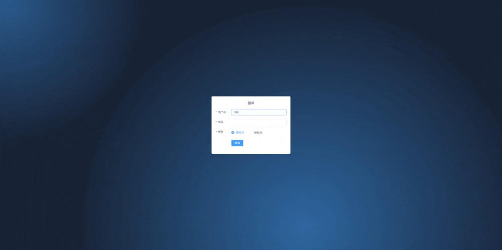
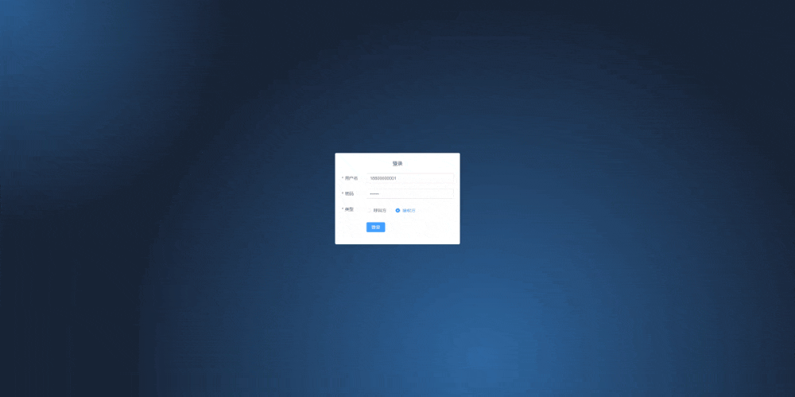

# Webrtc-demo 全栈式项目

##  1.前言

webrtc技术在现在的直播、短视频时代越来越火，之前一直很好奇其背后的原理，在读了一些文章之后，似乎有了点眉目，但实际企业级的项目绝对复杂很多，自己也有很多疑问，例如

- websocket 如何进行鉴权？
- sdp 和 icecandidate 协议格式说明
- peerconnection的流和track具体用法

后面再慢慢在网上查资料解惑吧。

纸上得来终觉浅，绝知此事要躬行， 所以动手实现了简易版的 webrtc 远程P2P连接。后续计划继续加入新功能：

- [ ] 房间创建
- [ ] 一对一，一对多 
- [ ] 弹幕
- [ ] 流加工


客户端页面用的vue3， 信令服务器用 go 编写。启动运行也非常简单，只需几行命令即可。


## 2.准备

前置工作在仓库内的`webrtc-demo-client` 和 `webrtc-demo-go`文件夹里 readme 中都有详细记录，这里就不再赘述了。


## 3.截图

1.开启两个浏览器窗口，并且使用内置账号登录，分别选择呼叫方和接受方。

```JS
18800000000/123456 // 用户1
18800000001/123456 // 用户2
```





在呼叫方共享屏幕后，点击呼叫。然后切换到接受方，就会看到弹框提示有呼叫，这时候我们点击接受，选择自己共享的屏幕，就可以看到接收方有呼叫方的共享屏幕了。


## 4.最后

欢迎各位提出宝贵的意见和讨论，如果有帮助到你非常开心~


## 5.参考

1. https://juejin.cn/post/7323087699479838730

2. https://juejin.cn/post/7267892210304565303
